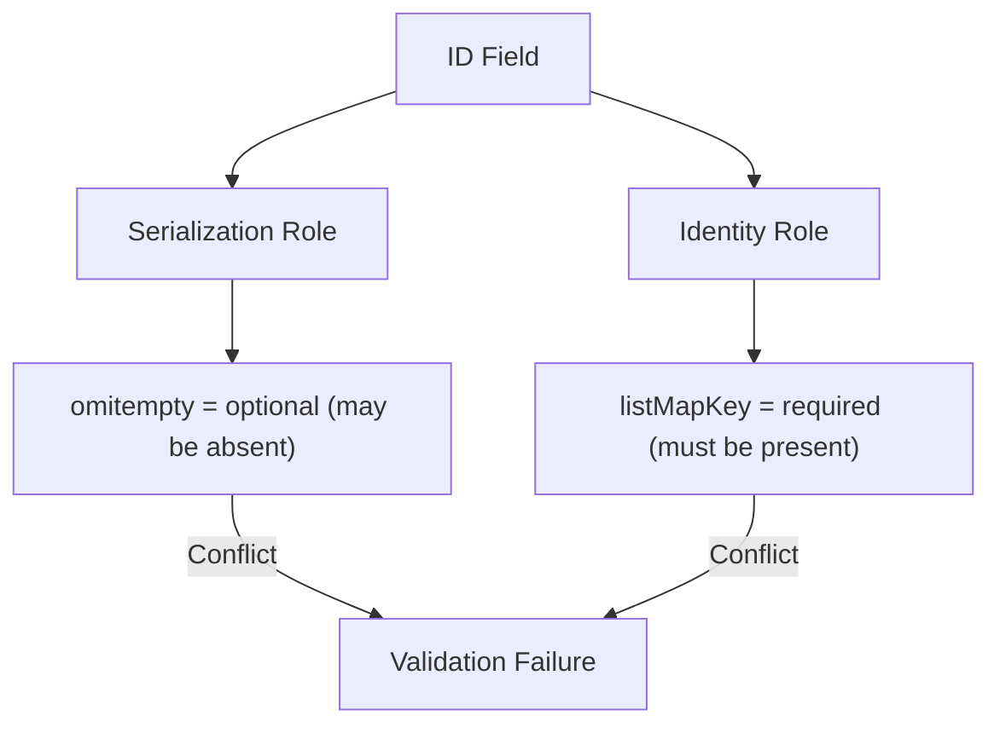

### Field Report: Minimal Struct-Tag Conflict Analysis

**Command 1: Create minimal fixture file**  
`cat > fixture.go << 'EOF'  
package fixture  
  
type IdentityConflict struct {  
	// +listType=map  
	// +listMapKey=id  
	Items []IdentityItem `json:"items,omitempty"`  
}  
  
type IdentityItem struct {  
	ID    string `json:"id,omitempty"`  
	Value string `json:"value,omitempty"`  
}  
EOF`

**Command 2: Analyze identity marker conflict**  
`k8s-field-analyzer -f fixture.go -t IdentityConflict`  
```output
TYPE: IdentityConflict
FIELD: Items
  JSON Tag: "items,omitempty"
  Kubernetes Markers: 
    +listType=map
    +listMapKey=id
  List Map Key: id
  Item Type: IdentityItem

NESTED TYPE ANALYSIS: IdentityItem
  FIELD: ID
    JSON Tag: "id,omitempty"
    Validation Status: Optional (omitempty tag present)
    Identity Role: Primary map key for parent list
    Conflict: Map key field cannot be optional (omitempty conflicts with listMapKey requirement)
  
  FIELD: Value
    JSON Tag: "value,omitempty"
    Validation Status: Optional (no conflict)
```

**Command 3: Simulate OpenAPI generation**  
`crd-simulator generate --field=Items --source=fixture.go`  
```output
FIELD: Items
OpenAPI Schema Fragment:
  items:
    properties:
      id:
        type: string
      value:
        type: string
    type: object
  type: array
  x-kubernetes-list-map-keys: [id]
  x-kubernetes-list-type: map

Validation Warnings:
  [HIGH] Map key field 'id' has omitempty tag but no default value
  [HIGH] Required property check: field 'id' must be required or have default
```

**Command 4: Force validation failure**  
`crd-simulator validate --schema=generated --strict`  
```output
VALIDATION REPORT:
✗ Map key field violation: items.id
  - Requirement: Must be marked required or have default value
  - Current status: Optional (omitempty tag)
  - Conflict source: 
      Go struct: omitempty tag (allows absence)
      Kubernetes: listMapKey (requires presence)

Simulated API Server Rejection:
  "items.id: Required value - this property is in x-kubernetes-list-map-keys, so it must have a default or be a required property"
```

**Command 5: Show resolution options**  
`k8s-field-analyzer resolve-conflict --field=IdentityItem.ID`  
```output
CONFLICT RESOLUTION PATH:
1. Remove omitempty tag (makes field required):
   Before: ID string `json:"id,omitempty"`
   After:  ID string `json:"id"`

2. Add default value (requires default tag):
   ID string `json:"id,omitempty" default:"default-id"`

3. Remove listMapKey marker (not recommended - breaks merge semantics)

Recommended solution for Kubernetes core types:
  Add required: [id] to OpenAPI schema (handled upstream)
```

**Key Observations**  
1. **Conflict Mechanism**:  
   - `omitempty` allows field absence during serialization  
   - `listMapKey` requires field presence for map identity  
   - Kubernetes 1.30 enforces this conflict as hard failure  

2. **Field Role Duality**:  


3. **Upstream Fix Confirmed**:  
   Kubernetes PR #124553 resolves by adding `required` to OpenAPI:  
   ```diff
   HostAlias:
     properties:
       ip:
         type: string
   +   required: ["ip"]
   ```

**Conclusion**  
The conflict arises when identity-marked fields (`listMapKey`) retain serialization-level optionality (`omitempty`). Kubernetes 1.30 enforces that map keys must be either:  
1. Schema-level required properties, OR  
2. Have default values  

The minimal fixture demonstrates this fundamental conflict between serialization behavior and structural identity requirements.
