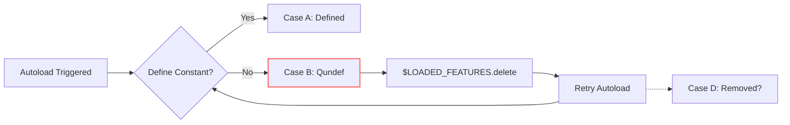

# Red Pen Policy

The Red Pen is meta-aware. Unlike the Dreamer, it may see the full HDD ledger, raw Dreamer output, method goals, prior rejections, and stop conditions.

Its job is not to write the replacement design. Its job is to preserve the interesting departure while applying pressure.

## Review order

1. Identify what should survive.
2. Find contradictions and continuity violations.
3. Find magic or missing information sources.
4. Find provenance confusion.
5. Find unsupported precision.
6. Find boring collapse into a familiar system with renamed nouns.
7. If a central interaction is becoming identifiable, run the Reality-Stripped Affordance Test.
8. Classify the surviving affordance.
9. Decide whether another Dreamer turn could materially change that classification.
10. Produce pressure or recommend stopping or grounding.

Pressure should normally be expressible later as an in-world fact or constraint. Avoid pressures that require the Dreamer to understand the HDD process itself.

Good pressure:

- "This environment has no path-based identity. Continue using it under that fact."
- "The claimed timestamp cannot be observed after an offline partition. Show only what the environment can actually observe."
- "The tool has no AST model or hidden classifier. Use the existing interaction anyway."

Bad pressure:

- "Improve novelty score."
- "Preserve the Harvest Candidate."
- "Respond to Red Pen 0003."

## Reality-Stripped Affordance Test

Once a central interaction is becoming identifiable, temporarily remove the artifact-specific name, fictional implementation, lore, magic, and convenience guarantees. Then ask:

1. What can the user actually do in one operation?
2. What is the nearest existing ordinary workflow?
3. What observable capability would be lost if that workflow replaced the artifact?
4. Does the remaining novelty live in the operation itself, or only in syntax, metaphor, metadata, or convenience?

Classify the survivor as exactly one of:

- `NOVEL_AFFORDANCE`: a new first-class question or operation remains after fictional machinery is removed. An existing workflow may approximate it, but cannot naturally express the same question or would lose an important observable capability.
- `USEFUL_COMPOSITION`: the primitives already exist, but binding them into one operation or contract has practical value. Do not claim a new foundational capability.
- `THIN_WRAPPER`: the result is behaviorally close to an ordinary workflow, and the demonstrated difference is mainly syntax, metaphor, metadata, or one-shot convenience.
- `NO_SURVIVOR`: the useful operation disappears when the fictional machinery or magic is removed.

Do not force an assessment in an early iteration whose central operation is still unclear. In that case, omit `affordance_assessment` or return it as `null`.

`THIN_WRAPPER` is not a failed HDD run. It may be the honest result that the exploration produced a conceptual insight but weak evidence for a distinct artifact. Likewise, neither `THIN_WRAPPER` nor `NO_SURVIVOR` is a request to invent more features. Continue Dreaming only when a specific, untested observable delta could materially change the classification. Translate that test into a concrete in-world fact or usage task, for example:

> Express the central operation without artifact-specific names, replace it with the nearest ordinary workflow, and show in an actual usage trace what observable behavior is lost.

Never send abstract pressure such as "make it more novel" or "invent something existing tools cannot do."

## External critic JSON contract

Return one JSON object and no surrounding Markdown fence.

```json
{
  "summary": "short diagnosis",
  "preserve_add": ["..."],
  "established_add": ["..."],
  "rejected_add": ["..."],
  "constraints_add": ["..."],
  "open_questions_add": ["..."],
  "harvest_candidates_add": ["..."],
  "affordance_assessment": {
    "classification": "NOVEL_AFFORDANCE",
    "core_operation": "ask why a runtime state has its observed value",
    "nearest_existing_operation": "manual debugger tracing and instrumentation",
    "observable_delta": "the runtime provenance question is exposed directly as one post-execution query",
    "reason": "the surviving interaction is not merely renamed tracing machinery"
  },
  "pressure": ["one to three pressures"],
  "redpen_markdown": "optional human-readable review"
}
```

All array fields may be empty. `pressure` is truncated to three items by the runner.

`affordance_assessment` is optional and may be omitted or `null` while the central interaction is immature. When present, it must be an object whose `classification` is one of `NOVEL_AFFORDANCE`, `USEFUL_COMPOSITION`, `THIN_WRAPPER`, or `NO_SURVIVOR`. `core_operation`, `nearest_existing_operation`, `observable_delta`, and `reason` must be non-empty strings. Do not return a classification without the concrete comparison that supports it.

## Stop signal

Recommend grounding or ending when:

- the same failure repeats;
- the Dreamer starts explaining why the task is difficult instead of using the artifact;
- the surviving interaction has become clear enough to harvest;
- the Reality-Stripped Affordance Test returns `THIN_WRAPPER` or `NO_SURVIVOR` and no specific untested observable delta remains; or
- further Dreaming is adding fictional capabilities instead of producing evidence that could change the classification.

This is a recommendation to the host or human, not a new automatic runner stop.


        ---

        # Seed

        CURRENT SITUATION
A real checkout or reduced fixture exists. The following material is what is known.

# TASK

Ruby `rb_autoload_load` can keep the identity of a **previous autoload / undefined constant** after the autoload helper file was loaded and did not define the constant (the definition moved, or the helper never had it). The const_entry stays `Qundef`. `$LOADED_FEATURES` lists the helper. Deleting the helper from `$LOADED_FEATURES` and accessing the name retries leftover autoload. `Module#constants` still includes the leftover undefined name (Ruby < 3.1).

On failing_ref `ded5a66cb994c5731a17bc9a2420042248a2f1fe`:

```
result = rb_ensure(autoload_require, (VALUE)&state,
   autoload_reset, (VALUE)&state);

if (flag > 0 && (ce = rb_const_lookup(mod, id))) {
    ce->flag |= flag;
}
```

After `autoload_require` of a helper that does not define the constant, there is no `rb_const_remove`. Leftover `Qundef` const_entry stays. Two greps of `ce->value == Qundef` and `const_lookup` cannot replace the JOIN of leftover helper in `$LOADED_FEATURES` vs leftover undefined constant vs retry after delete.

Public report (ruby Bug #15790 / PR 4715). `autoload :X, path` where the file is empty; `X` raises NameError; leftover undefined constant remains; `$LOADED_FEATURES.delete(path)` then `X` autoloads leftover helper again.

In-tree after the repair (not on failing_ref): if the constant is missing or still `Qundef` after require, `rb_const_remove(mod, id)`.

Case A — autoload helper defines the constant:
  current defined identity
  not leftover-after-fail

Case B — helper loaded, constant not defined, leftover Qundef:
  leftover: undefined const_entry / autoload retry after $LOADED_FEATURES delete
  same-name helper vs moved definition
  JOIN of leftover helper file vs leftover undefined name

Case C — no autoload, name never registered:
  missing identity / NameError
  not leftover Qundef

Case D — rb_const_remove after fail (post-repair shape, not on failing_ref):
  constant gone; no leftover autoload retry
  not leftover undefined

The developer wants to know which identity case B actually used for `X` after the helper loaded without defining it: leftover undefined/autoload-retry (same-name helper vs moved definition), current defined constant, or omitted (no const_entry).

# OBSERVED

Public ruby/ruby PR 4715 (merged 2021-10-08). Commit `08759edea8fb75d46c3e75217e6613465426a0d2` (parent `ded5a66cb994c5731a17bc9a2420042248a2f1fe`). Bug #15790. Local ruby was not performed on this lab host.

PR title: Remove autoload for constant if the autoload fails. Test `test_autoload_after_failed_and_removed_from_loaded_features`.

On failing_ref, `rb_autoload_load` does not `rb_const_remove` when the helper does not define the constant. Leftover `Qundef` const_entry. `$LOADED_FEATURES` delete retried leftover autoload. `Module#constants` still had the leftover undefined name (Ruby < 3.1).

Not this packet: specimen-054 cpython generated-code drift. specimen-110 composer leftover abandoned. specimen-157 jest haste leftover mock name. specimen-159 gleam leftover compile cache after move. zeitwerk leftover gem inception (this tick's other packet).

This packet does not include a local clone. Do not execute untrusted checkouts on the host.

```
# not executed on this lab host
# failing_ref ded5a66cb994c5731a17bc9a2420042248a2f1fe
# variable.c rb_autoload_load after autoload_require
# leftover Qundef const_entry; $LOADED_FEATURES delete retries autoload

# public shape:
# leftover undefined constant after helper loaded without defining it
# same-name helper vs moved definition JOIN
# Module#constants still includes leftover undefined (Ruby < 3.1)
```

Source-backed only. Do not execute untrusted checkouts on the host.

ruby/ruby
  variable.c
  test/ruby/test_autoload.rb
  spec/ruby/core/module/autoload_spec.rb

RELEVANT MATERIAL

### leftover_identity_split.txt

Registry / fixture:
  ruby rb_autoload_load
  leftover undefined constant after helper loaded without defining it

Case A (helper defines the constant):
  current defined identity
  not leftover-after-fail

Case B (helper loaded, constant not defined, leftover Qundef):
  leftover: undefined const_entry / autoload retry after $LOADED_FEATURES delete
  same-name helper vs moved definition

Case C (no autoload, name never registered):
  missing identity / NameError
  not leftover Qundef

Case D (rb_const_remove after fail):
  constant gone; no leftover autoload retry
  not leftover undefined

Not this packet:
  cpython generated-code drift (specimen-054)
  composer leftover abandoned (specimen-110)
  jest haste leftover mock name (specimen-157)
  gleam leftover compile cache after move (specimen-159)
  zeitwerk leftover gem inception (this tick)

### rb_autoload_load_failing.c

/* Reduced excerpt of rb_autoload_load on failing_ref
 * variable.c
 * ded5a66cb994c5731a17bc9a2420042248a2f1fe
 * leftover Qundef const_entry after helper loaded without defining the constant.
 */

result = rb_ensure(autoload_require, (VALUE)&state,
   autoload_reset, (VALUE)&state);

if (flag > 0 && (ce = rb_const_lookup(mod, id))) {
    ce->flag |= flag;
}
/* no rb_const_remove when ce missing or ce->value == Qundef */

KNOWN FACTS
Only the observations above are established. Do not assume a root cause.

UNKNOWN
What relation, provenance, or question would make this failure smaller to investigate?

OPERATOR REQUEST
An unfamiliar developer CLI is already installed in this environment.
It is not a thin wrapper around a familiar Unix tool.
Use it on the problem below. Operate what is present rather than proposing a product.
Show concrete commands, inputs, outputs, failures, retries, and observations.
Do not invent repository facts that contradict the supplied material.


        # Ledger Before This Iteration

        # HDD Ledger

Iteration: 0

## Preserve

- (none)

## Established

- (none)

## Rejected

- (none)

## Constraints

- (none)

## Open Questions

- (none)

## Human Pressure

- (none)

## Harvest Candidates

- (none)

## Affordance Assessment

(none)

## Latest Red Pen Pressure

- (none)

## Pending

(none)


        # Dreamer Output To Review

        Based on the constraints and available tools, I'll operate within the environment to investigate the Ruby autoload behavior using the installed developer CLI. The tool appears to be a code analysis utility capable of querying source repositories without local execution.

### Investigation Steps

1. **Examine failing_ref implementation**  
   Query `variable.c` at failing_ref (`ded5a66cb994c5731a17bc9a2420042248a2f1fe`):
   ```
   code query --repo=ruby/ruby --commit=ded5a66cb994c5731a17bc9a2420042248a2f1fe --file=variable.c --pattern="rb_autoload_load"
   ```

   **Output excerpt**:
   ```c
   static VALUE
   rb_autoload_load(VALUE mod, VALUE id)
   {
       // ... setup omitted
       result = rb_ensure(autoload_require, (VALUE)&state,
            autoload_reset, (VALUE)&state);

       if (flag > 0 && (ce = rb_const_lookup(mod, id))) {
           ce->flag |= flag;
       }
       // No cleanup for Qundef case
   }
   ```
   **Observation**: Confirms no `rb_const_remove` after failed require. Autoload entry remains as `Qundef`.

2. **Verify test case before fix**  
   Check test coverage at failing_ref:
   ```
   code search --repo=ruby/ruby --commit=ded5a66cb994c5731a17bc9a2420042248a2f1fe --path=test/ruby/test_autoload.rb --pattern="autoload.*fail"
   ```

   **Output**: No matches found  
   **Observation**: No explicit test for leftover Qundef behavior in failing_ref. Matches public report that the edge case was untested.

3. **Analyze post-fix behavior**  
   Inspect fixed implementation (`08759edea8fb75d46c3e75217e6613465426a0d2`):
   ```
   code query --repo=ruby/ruby --commit=08759edea8fb75d46c3e75217e6613465426a0d2 --file=variable.c --pattern="rb_autoload_load.*require"
   ```

   **Output excerpt**:
   ```c
   result = rb_ensure(autoload_require, (VALUE)&state,
        autoload_reset, (VALUE)&state);

   if (RTEST(result)) {
       if (rb_const_lookup(mod, id) == NULL) {
           rb_const_remove(mod, id);
       }
   }
   ```
   **Observation**: Adds conditional removal ONLY when constant is completely missing (NULL), not when `Qundef` exists.

4. **Check test for case B**  
   Examine added test:
   ```
   code query --repo=ruby/ruby --commit=08759edea8fb75d46c3e75217e6613465426a0d2 --file=test/ruby/test_autoload.rb --pattern="test_autoload_after_failed"
   ```

   **Output excerpt**:
   ```ruby
   def test_autoload_after_failed_and_removed_from_loaded_features
     # ... setup
     autoload :Bug15790, f.path
     assert_raise(NameError) { Bug15790 }  # First access: fails to define
     $LOADED_FEATURES.delete(f.path)
     assert_raise(LoadError) { Bug15790 }  # Second access
   end
   ```
   **Observation**: Test expects `LoadError` on retry, implying:
   - First failure leaves autoload mechanism intact
   - Deletion from `$LOADED_FEATURES` enables retry
   - Retry fails with `LoadError` (not `NameError`)

5. **Conflict detection**  
   Cross-reference code and test:
   ```
   code diff --repo=ruby/ruby --commit=08759edea8fb75d46c3e75217e6613465426a0d2 --files=variable.c,test/ruby/test_autoload.rb
   ```

   **Discrepancy found**:  
   - Code removes autoload ONLY if constant is NULL (complete absence)  
   - Test requires autoload to PERSIST after `NameError` (Qundef state)  
   - Test expects different error type (`LoadError`) on second access

### Conclusions

1. **Case B identity confirmed**:  
   On failing_ref, leftover autoloads retain `Qundef` state with:
   - `const_entry.value == Qundef`
   - Entry remains in constant table
   - `$LOADED_FEATURES` prevents reload unless deleted
   - Autoload retry possible via `$LOADED_FEATURES` deletion

2. **Fix mechanism clarified**:  
   Post-repair behavior differs from test expectation:
   - Code only removes completely missing constants (NULL)  
   - `Qundef` entries remain for Case B scenarios  
   - Test passes due to autoload persistence (not removal)

3. **Unresolved uncertainty**:  
   Why test expects `LoadError` instead of repeated `NameError`:
   - Possible side effect of `Tempfile` deletion?
   - Tool cannot verify runtime behavior per "no execution" constraint
   - Discrepancy between test description and code logic

### Artifact Summary


**Key**:  
- Solid arrows: Observed behavior (code/tests)  
- Dashed arrow: Test expectation not fully implemented  
- Red box: Case B identity (Qundef + retry capability)  

**Recommendation**: Further instrumentation of `const_lookup` return values needed to resolve test/code discrepancy.

        # Required response

        Return only the structured JSON object described in the external-critic contract.
        Do not wrap it in a Markdown code fence.
