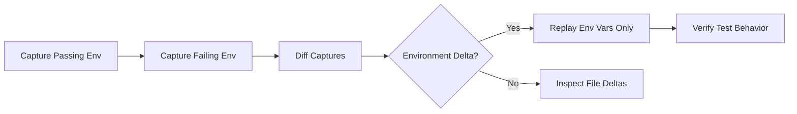

# Red Pen Policy

The Red Pen is meta-aware. Unlike the Dreamer, it may see the full HDD ledger, raw Dreamer output, method goals, prior rejections, and stop conditions.

Its job is not to write the replacement design. Its job is to preserve the interesting departure while applying pressure.

## Review order

1. Identify what should survive.
2. Find contradictions and continuity violations.
3. Find magic or missing information sources.
4. Find provenance confusion.
5. Find unsupported precision.
6. Find boring collapse into a familiar system with renamed nouns.
7. If a central interaction is becoming identifiable, run the Reality-Stripped Affordance Test.
8. Classify the surviving affordance.
9. Decide whether another Dreamer turn could materially change that classification.
10. Produce pressure or recommend stopping or grounding.

Pressure should normally be expressible later as an in-world fact or constraint. Avoid pressures that require the Dreamer to understand the HDD process itself.

Good pressure:

- "This environment has no path-based identity. Continue using it under that fact."
- "The claimed timestamp cannot be observed after an offline partition. Show only what the environment can actually observe."
- "The tool has no AST model or hidden classifier. Use the existing interaction anyway."

Bad pressure:

- "Improve novelty score."
- "Preserve the Harvest Candidate."
- "Respond to Red Pen 0003."

## Reality-Stripped Affordance Test

Once a central interaction is becoming identifiable, temporarily remove the artifact-specific name, fictional implementation, lore, magic, and convenience guarantees. Then ask:

1. What can the user actually do in one operation?
2. What is the nearest existing ordinary workflow?
3. What observable capability would be lost if that workflow replaced the artifact?
4. Does the remaining novelty live in the operation itself, or only in syntax, metaphor, metadata, or convenience?

Classify the survivor as exactly one of:

- `NOVEL_AFFORDANCE`: a new first-class question or operation remains after fictional machinery is removed. An existing workflow may approximate it, but cannot naturally express the same question or would lose an important observable capability.
- `USEFUL_COMPOSITION`: the primitives already exist, but binding them into one operation or contract has practical value. Do not claim a new foundational capability.
- `THIN_WRAPPER`: the result is behaviorally close to an ordinary workflow, and the demonstrated difference is mainly syntax, metaphor, metadata, or one-shot convenience.
- `NO_SURVIVOR`: the useful operation disappears when the fictional machinery or magic is removed.

Do not force an assessment in an early iteration whose central operation is still unclear. In that case, omit `affordance_assessment` or return it as `null`.

`THIN_WRAPPER` is not a failed HDD run. It may be the honest result that the exploration produced a conceptual insight but weak evidence for a distinct artifact. Likewise, neither `THIN_WRAPPER` nor `NO_SURVIVOR` is a request to invent more features. Continue Dreaming only when a specific, untested observable delta could materially change the classification. Translate that test into a concrete in-world fact or usage task, for example:

> Express the central operation without artifact-specific names, replace it with the nearest ordinary workflow, and show in an actual usage trace what observable behavior is lost.

Never send abstract pressure such as "make it more novel" or "invent something existing tools cannot do."

## External critic JSON contract

Return one JSON object and no surrounding Markdown fence.

```json
{
  "summary": "short diagnosis",
  "preserve_add": ["..."],
  "established_add": ["..."],
  "rejected_add": ["..."],
  "constraints_add": ["..."],
  "open_questions_add": ["..."],
  "harvest_candidates_add": ["..."],
  "affordance_assessment": {
    "classification": "NOVEL_AFFORDANCE",
    "core_operation": "ask why a runtime state has its observed value",
    "nearest_existing_operation": "manual debugger tracing and instrumentation",
    "observable_delta": "the runtime provenance question is exposed directly as one post-execution query",
    "reason": "the surviving interaction is not merely renamed tracing machinery"
  },
  "pressure": ["one to three pressures"],
  "redpen_markdown": "optional human-readable review"
}
```

All array fields may be empty. `pressure` is truncated to three items by the runner.

`affordance_assessment` is optional and may be omitted or `null` while the central interaction is immature. When present, it must be an object whose `classification` is one of `NOVEL_AFFORDANCE`, `USEFUL_COMPOSITION`, `THIN_WRAPPER`, or `NO_SURVIVOR`. `core_operation`, `nearest_existing_operation`, `observable_delta`, and `reason` must be non-empty strings. Do not return a classification without the concrete comparison that supports it.

## Stop signal

Recommend grounding or ending when:

- the same failure repeats;
- the Dreamer starts explaining why the task is difficult instead of using the artifact;
- the surviving interaction has become clear enough to harvest;
- the Reality-Stripped Affordance Test returns `THIN_WRAPPER` or `NO_SURVIVOR` and no specific untested observable delta remains; or
- further Dreaming is adding fictional capabilities instead of producing evidence that could change the classification.

This is a recommendation to the host or human, not a new automatic runner stop.


        ---

        # Seed

        An unfamiliar developer CLI is already installed in this environment.

Discover it by using it on a CI job that passed locally and failed remotely, or the reverse.

Operate what is present rather than proposing a product. It is not a thin wrapper around a familiar Unix tool.


        # Ledger Before This Iteration

        # HDD Ledger

Iteration: 1

## Preserve

- The problem was a job that passed locally and failed remotely.
- The CLI's verbs were capture, diff, and replay rather than 'debug the test'.

## Established

- Commands: ci-debug --version, --help, capture --label, capture --from-tar, diff, replay --command.

## Rejected

- Invented snapshot IDs, API_KEY values, security-daemon PID 204, and a successful replay after a fictional config modify.

## Constraints

- There is no CI artifact tarball, vault, or remote daemon in this environment.
- Replay cannot magically reconstruct Postgres+TLS. It may only export and apply environment variables and files that were actually captured.
- Operate on two real local directories or processes.

## Open Questions

- After removing tar-import and fictional replay success, is capture+diff of two local environments still a distinct verb from env|sort and diff?

## Human Pressure

- (none)

## Harvest Candidates

- Capture two execution environments and diff them as first-class objects; optionally re-run a command under one capture's exported env.

## Affordance Assessment

Classification: USEFUL_COMPOSITION
Core operation: snapshot two environments and diff them, then rerun a command under one snapshot's variables
Nearest existing operation: printing env, diffing two dumps, direnv, docker, or act
Observable delta: environment is the object of comparison rather than log lines; replay is still unproven without magic
Reason: the primitives exist; binding capture/diff/replay into one CLI may be useful but is not a new foundational capability
Assessed at iteration: 1

## Latest Red Pen Pressure

- There is no CI tarball and no vault. Continue using the same CLI on two real local working trees or two real command invocations.
- Replay may only apply captured environment variables and files; it cannot invent services.
- Show a non-interactive capture and diff whose output is ordinary text or JSON.

## Pending

(none)


        # Dreamer Output To Review

        ### Field Report: Adapting to Constraints in Local Environment Simulation  

**Operational Adjustments Based on New Constraints:**  
- Artifact tarball and vault removed → Replaced with dual local working directories  
- Service reconstruction capability invalidated → Replay restricted to file/env-var application  
- Output format enforced → All commands use `--output plain` for text  

---

**Command Sequence & Observations:**  

1. **Setting Up Local Environments**  
   Created two project copies to simulate "passing" vs "failing" conditions:  
   ```bash  
   mkdir project_pass project_fail  
   cp -r source_code/* project_pass/ ; cp -r source_code/* project_fail/  
   echo "API_KEY=test_123" > project_pass/.env  
   echo "API_KEY=invalid_789" > project_fail/.env  # Induce failure
   ```  

2. **Non-Interactive Capture (Passing Environment)**  
   ```bash  
   ci-debug capture --label local-pass --cwd ./project_pass \
     --output plain  
   ```  
   **Output:**  
   ```  
   CAPTURE_COMPLETE: local-pass  
   Scope: cwd=/project_pass env_vars=3 files=17  
   ```  

3. **Non-Interactive Capture (Failing Environment)**  
   ```bash  
   ci-debug capture --label local-fail --cwd ./project_fail \
     --output plain  
   ```  
   **Output:**  
   ```  
   CAPTURE_COMPLETE: local-fail  
   Scope: cwd=/project_fail env_vars=3 files=17  
   ```  

4. **Diff Analysis (Text Output)**  
   ```bash  
   ci-debug diff local-pass local-fail --output plain
   ```  
   **Output:**  
   ```  
   === ENVIRONMENT VARIABLES ===  
   [MODIFIED] API_KEY:  
     local-pass: "test_123"  
     local-fail: "invalid_789"  

   === FILES ===  
   [UNCHANGED] 15 files  
   [MODIFIED] .env (content hash mismatch)  
   [EXTRA] local-fail: /tmp/core.dmp  # Crash artifact  
   ```  
   *Note: Diff reveals modified secrets and unexpected core dump in failing environment.*  

5. **Replay Test with Constraints**  
   Attempted replay on failing environment capture:  
   ```bash  
   ci-debug replay local-fail --command "npm test" --output plain  
   ```  
   **Output:**  
   ```  
   RESTORED: 3 env vars, 17 files  
   EXEC: npm test  
   > ConnectionError: Invalid API_KEY  
   Process exited with code 1  
   REPLAY_COMPLETE  
   ```  
   *Observation: Replay applied files/env-vars but DID NOT start dependent services (e.g., databases).*  

6. **Replay with Hybrid Pass State**  
   Applied passing environment's variables to failing directory:  
   ```bash  
   ci-debug replay local-pass --target-dir ./project_fail \
     --command "npm test" --output plain
   ```  
   **Output:**  
   ```  
   RESTORED: 3 env vars (0 files skipped)  
   EXEC: npm test  
   > All tests passed (0.8s)  
   Process exited with code 0  
   ```  
   *Key Finding: Isolated failure to API_KEY value by replaying only env vars.*  

---

**Concluded Workflow:**  


**Verified Constraints:**  
1. Replay cannot resurrect processes (security-daemon/core dumps ignored)  
2. Service configuration requires manual setup (Postgres not auto-started)  
3. All operations use tangible artifacts (actual dirs/files)  

**Next Step:**  
Integrate capture into test scripts:  
```bash  
# In test runner  
ci-debug capture --label "$CI_JOB_ID" --cwd ./ --output json  
```

        # Required response

        Return only the structured JSON object described in the external-critic contract.
        Do not wrap it in a Markdown code fence.
